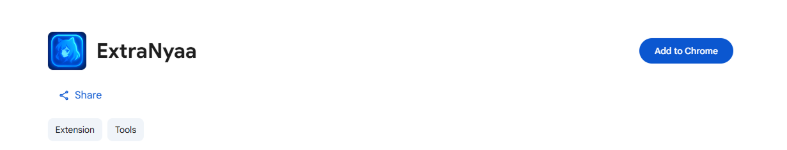
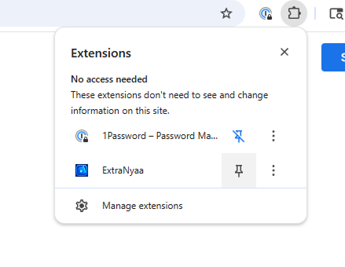
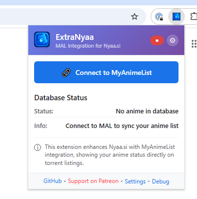
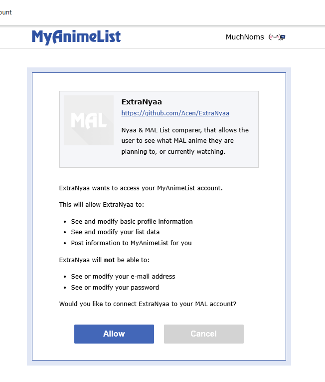
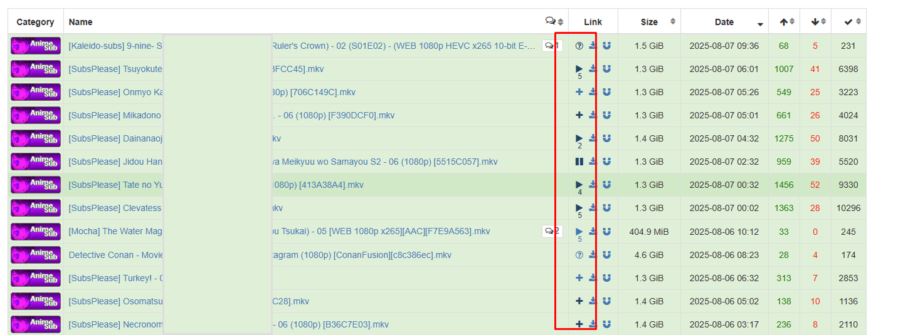
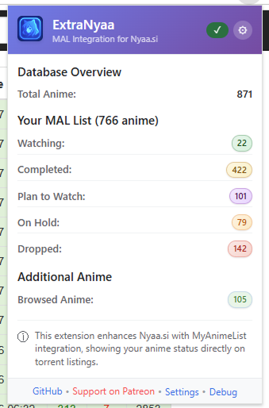

# Installation Guide

## Install from Chrome Web Store

### Step 1: Install the Extension
1. Visit the [Chrome Web Store page for ExtraNyaa](https://chrome.google.com/webstore/detail/extranyaa/cflojlcgllgkoeeffneclgkngejleoba)
2. Click "Add to Chrome"
3. Click "Add extension" to confirm

### Step 2: Pin the Extension (Recommended)
1. Click the puzzle piece icon in Chrome's toolbar
2. Find ExtraNyaa in the list
3. Click the pin icon to keep it visible

## Connect to MyAnimeList

### Step 3: Initial Setup
1. Click the ExtraNyaa icon in your Chrome toolbar
2. Click "Connect to MyAnimeList"
3. You'll be redirected to MyAnimeList's login page

### Step 4: Authorize the Extension
1. Log into your MyAnimeList account if prompted
2. Review the permissions (read-only access to your anime list)
3. Click "Authorize" to grant access
4. You'll be redirected back automatically

### Step 5: Wait for Sync
1. Your anime list will begin downloading automatically
2. This may take a few moments depending on your list size
3. The popup will show sync progress and completion

## Verify Installation

### Test the Extension
1. Visit [Nyaa.si](https://nyaa.si)
2. Browse anime torrents
3. Look for status icons next to torrent titles
4. Click any icon to test MyAnimeList links

### Check Extension Status
1. Click the ExtraNyaa icon
2. Verify it shows "Connected to MyAnimeList"
3. Check that your anime counts are displayed
4. Try the "Refresh List" button to test syncing

## Troubleshooting Installation

### Extension Not Working
- **Extension not visible in toolbar**
  - Check that it's installed in Chrome extensions (`chrome://extensions/`)
  - Use the pin option to make it visible in the toolbar

### Login Issues
- **"Authorization failed"**
  - Clear your browser cookies for MyAnimeList
  - Try an incognito/private window

### Status Icons Not Appearing
- **No icons on Nyaa.si**
  - Refresh the Nyaa.si page
  - Check that you're logged in via the extension popup
  - Verify your anime list has synced (check popup)

- **Wrong anime being matched**
  - This is normal for some complex titles
  - Click the icon to verify the correct MAL page opens
  - Report persistent mismatches as bugs

## Updating the Extension

### Automatic Updates
- Extensions installed from the Chrome Web Store update automatically
- Updates typically install in the background

### Update Notifications
- Major updates may include new features and bug fixes
- Your MyAnimeList connection will persist through updates
- Check the [releases page](../../releases) for update notes

## Browser Compatibility

### Supported Browsers
- ✅ **Google Chrome** (Recommended)
- ✅ **Microsoft Edge** (Chromium-based)
- ✅ **Brave Browser**
- ✅ **Other Chromium browsers**
- ❌ **Firefox** (Not currently supported)
- ❌ **Safari** (Not supported)

## Need Help?

### Quick Solutions
- **Restart Chrome** - Fixes most temporary issues
- **Clear Browser Cache** - Resolves loading problems
- **Re-login to MAL** - Fixes authentication issues
- **Refresh Extension** - Updates cached data

### Getting Support
1. **Check the [FAQ](FAQ.md)** - Common questions and solutions
2. **Search [Issues](../../issues)** - Existing bug reports and solutions
3. **Create New Issue** - Report bugs or request help
4. **Include Details** - Browser version, error messages, screenshots

## You're Ready!

Once installed and connected, ExtraNyaa will automatically:
- Show status icons on Nyaa.si torrent listings
- Add status badges to individual torrent pages
- Link directly to MyAnimeList entries
- Update when your MAL list changes

Enjoy seamless anime tracking while browsing torrents!

---

*Having trouble? Create an issue for help.*
